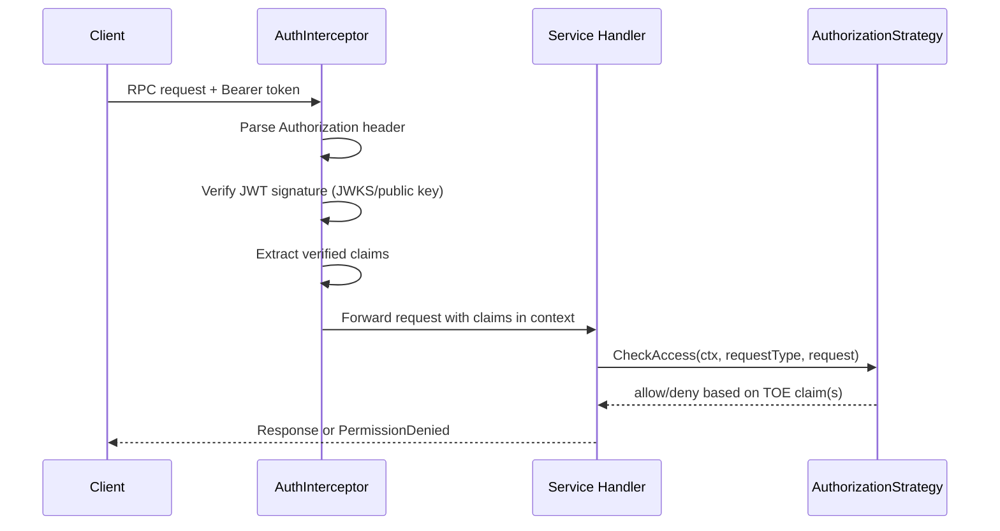

# Authentication and Authorization in Confirmate Core

This document explains how request authentication and target-of-evaluation authorization currently work in `core`.

## Overview

The security flow is intentionally split into two layers:

1. **Authentication (server interceptor layer)**
   - Verifies bearer JWTs.
   - Rejects unauthenticated requests early.
   - Stores verified claims in request context.

2. **Authorization (service layer)**
   - Uses a configured authorization strategy.
   - Evaluates whether the caller can access a specific target of evaluation (TOE).
   - Returns `permission denied` for unauthorized requests.

## Authentication Flow

Authentication is handled by `AuthInterceptor`:

- File: `server/auth_interceptor.go`
- Registered from server commands when `auth-enabled` is set:
  - `server/commands/orchestrator.go`
  - `server/commands/confirmate.go`

### Sequence diagram

### What it does

For unary and streaming handler requests:

1. Reads `Authorization` header.
2. Extracts bearer token (`Bearer <token>`).
3. Verifies token signature:
   - via JWKS (`WithJWKS`) or
   - via static public key (`WithPublicKey`).
4. Parses **verified** JWT claims.
5. Stores claims in context via `auth.WithClaims(...)`.
6. Calls next handler.

If anything fails, it returns `connect.CodeUnauthenticated`.

### Why claims are in context

Authorization logic no longer re-parses raw tokens. It reads claims from context so downstream code only uses claims from already-verified tokens.

- Context helpers: `auth/context.go`
- Claims are consumed by authorization strategy in `service/authorization.go`

## Authorization Flow

Authorization is strategy-based:

- Interface: `service.AuthorizationStrategy`
- Default implementation for JWT claim checks: `service.AuthorizationStrategyJWT`

### Strategy behavior

`AuthorizationStrategyJWT` reads two claim keys:

- `TargetOfEvaluationsKey` (default: `TargetOfEvaluationid`)
- `AllowAllKey` (default: `cladmin`)

The strategy returns:

- **allow all** if `AllowAllKey == true`
- otherwise, a list of allowed TOE IDs from `TargetOfEvaluationsKey`

## Where authorization is enforced

Authorization is enforced in service handlers by calling:

- `svc.authz.CheckAccess(ctx, requestType, requestLikeObject)`

The `requestLikeObject` must implement `api.HasTargetOfEvaluationId`.

### Current coverage

- Assessment service:
  - `service/assessment/assessment.go` (`AssessEvidence`)
- Orchestrator service (TOE-scoped handlers), including:
  - `service/orchestrator/toe.go`
  - `service/orchestrator/audit_scope.go`
  - `service/orchestrator/certificates.go`
  - `service/orchestrator/assessment_results.go`

List handlers also constrain query results to allowed TOE IDs using `AllowedTargetOfEvaluations(...)`.

## Configuration

When auth is enabled in server commands:

- Authentication interceptor is enabled (`AuthInterceptor`).
- Services are configured with JWT authorization strategy:
  - `orchestrator.WithAuthorizationStrategyJWT(...)`
  - `assessment.WithAuthorizationStrategyJWT(...)`

Command flags involved include:

- `auth-enabled`
- `auth-jwks-url`

## Error semantics

- Invalid/missing token: `connect.CodeUnauthenticated`
- Valid token but insufficient TOE permissions: `connect.CodePermissionDenied`

## Notes for contributors

- Keep authentication in interceptors and authorization in service methods.
- Prefer `svc.authz.CheckAccess(...)` for TOE-scoped operations.
- For list endpoints, also scope database queries to allowed TOE IDs.
- Do not parse unverified tokens in service code.
- If you change authentication/authorization behavior, update this document in the same PR.
