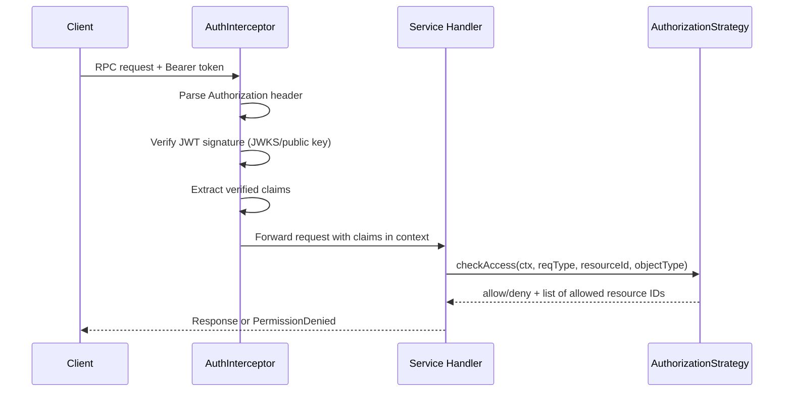

# Authentication and Authorization in Confirmate Core

This document explains how request authentication and authorization currently work in `core`.

## Overview

The security flow is split into two layers:

1. **Authentication (server interceptor layer)**
   - Verifies bearer JWTs on incoming requests.
   - Rejects unauthenticated requests early.
   - Stores verified claims in the request context.

2. **Authorization (service layer)**
   - Uses a configured `AuthorizationStrategy`.
   - Evaluates whether the caller can access a specific resource.
   - Returns `permission denied` for unauthorized requests.

## Authentication Flow

Authentication is handled by `AuthInterceptor`:

- File: `server/auth_interceptor.go`
- Registered from server commands when `auth-enabled` is set:
  - `server/commands/orchestrator.go`
  - `server/commands/confirmate.go`
  - `server/commands/evaluation.go`

### Sequence diagram



### What it does

For unary and streaming handler requests:

1. Reads `Authorization` header.
2. Extracts bearer token (`Bearer <token>`).
3. Verifies token signature:
   - via JWKS (`WithJWKS`) or
   - via static public key (`WithPublicKey`).
4. Parses **verified** JWT claims.
5. Stores claims in context via `auth.WithClaims(...)`.
6. Calls next handler.

If anything fails, it returns `connect.CodeUnauthenticated`.

### Why claims are in context

Authorization logic no longer re-parses raw tokens. It reads claims from context so downstream code only uses claims from already-verified tokens.

- Context helpers: `auth/context.go`
- Claims are consumed by `checkAccess` helpers in each service package.

## Authorization Flow

Authorization is strategy-based:

- Interface: `service.AuthorizationStrategy` (`service/authorization.go`)
- Two concrete implementations:
  - `AuthorizationStrategyAllowAll` — permits everything; used when `auth-enabled` is false.
  - `AuthorizationStrategyPermissionStore` — checks permissions stored in the orchestrator; used when `auth-enabled` is true.

### AuthorizationStrategyPermissionStore

This strategy requires a `PermissionStore` implementation that can answer two questions:

- `HasPermission(userId, resourceId, permission, objectType)` → bool
- `PermissionForResources(userId, permission, objectType)` → []resourceId

The orchestrator service uses a database-backed `permissionStore` (`service/orchestrator/user.go`).

The evaluation service — which has no database — uses an `orchestratorPermissionStore`
(`service/evaluation/permission_store.go`) that calls `ListUserPermissions` on the orchestrator over
the service-to-service connection.

### Admin bypass

Before any permission store lookup, both strategies check the `IsAdmin()` flag on the JWT claims.
If the caller is an admin, access is unconditionally granted.

## Service-to-Service Authentication

When services call the orchestrator on their own behalf (e.g., for scheduled evaluation jobs or
permission lookups), they use OAuth 2.0 client credentials flow:

- Client ID/secret: `confirmate` / `confirmate` (defaults, overridable via flags)
- Token endpoint: the orchestrator's embedded OAuth server at `/v1/auth/token`
- The resulting token is injected at the **HTTP transport level** (not via the request context),
  which means scheduled background jobs do not need to inherit a user's token.

This is wired up in `NewService` when `Config.ServiceOAuth2Config` is non-nil.

## Where authorization is enforced

Each service defines a package-local `checkAccess` helper that extracts the user ID from context
claims and delegates to the configured strategy. This helper is called at the top of each
protected handler, before any business logic.

Pattern (from `service/orchestrator/user.go`, `service/evaluation/user.go`):

```go
allowed, resourceIDs, err := checkAccess(ctx, svc.authz, reqType, resourceId, objectType)
if err != nil {
    return nil, connect.NewError(connect.CodeInternal, err)
}
if !allowed {
    return nil, service.ErrPermissionDenied
}
```

The orchestrator's `checkAccess` also performs **JIT user provisioning**: on every authenticated
request it creates or updates the user record in the database from the JWT claims.
The evaluation service's `checkAccess` omits this step (no DB).

### Current coverage

- Orchestrator service: most resource handlers in
  - `service/orchestrator/toe.go`
  - `service/orchestrator/audit_scope.go`
  - `service/orchestrator/certificates.go`
  - `service/orchestrator/assessment_results.go`
  - `service/orchestrator/user.go`
- Evaluation service:
  - `service/evaluation/service.go` (`StartEvaluation`, `StopEvaluation`)

List handlers also constrain query results to allowed resource IDs using
`authz.AllowedTargetOfEvaluations(ctx)` or `authz.AllowedAuditScopes(ctx)`.

## Configuration

When auth is enabled in server commands, the following options are applied:

| Command       | Incoming auth interceptor | Authorization strategy        |
|---------------|---------------------------|-------------------------------|
| `orchestrator`| `AuthInterceptor` (JWKS)  | `PermissionStore` (DB-backed) |
| `confirmate`  | `AuthInterceptor` (JWKS)  | `PermissionStore` (DB-backed) |
| `evaluation`  | `AuthInterceptor` (JWKS)  | `PermissionStore` (orchestrator-backed) |

Command flags involved:

- `auth-enabled` — enable JWT validation on incoming requests
- `auth-jwks-url` — JWKS URL for token verification
- `service-oauth2-token-endpoint` — token endpoint for service-to-service auth
- `service-oauth2-client-id` — service client ID (default: `confirmate`)
- `service-oauth2-client-secret` — service client secret (default: `confirmate`)

## Error semantics

- Invalid/missing token → `connect.CodeUnauthenticated`
- Valid token but insufficient permissions → `connect.CodePermissionDenied`

## Notes for contributors

- Keep authentication in interceptors; keep authorization in service methods.
- Use the package-local `checkAccess` helper — do not call `svc.authz.CheckAccess` directly from handlers.
- For list endpoints, also scope database (or API) queries to allowed resource IDs.
- Do not parse unverified tokens in service code.
- If you change authentication/authorization behavior, update this document in the same PR.
