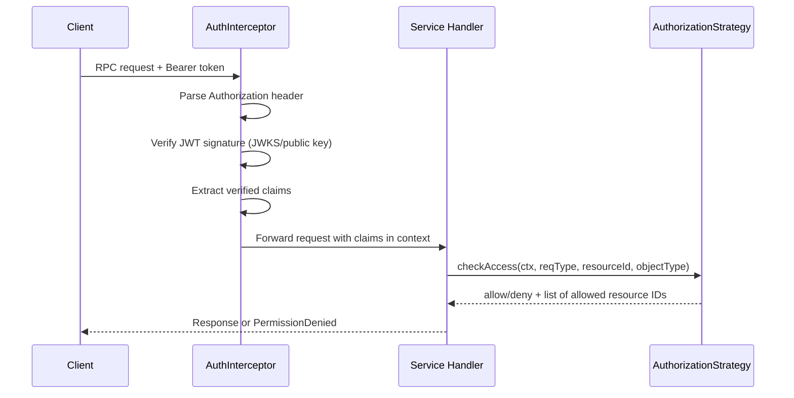

# Authentication and Authorization in Confirmate Core

This document explains how request authentication and authorization currently work in `core`.

## Overview

The security flow is split into two layers:

1. **Authentication (server interceptor layer)**
   - Verifies bearer JWTs on incoming requests.
   - Rejects unauthenticated requests early.
   - Stores verified claims in the request context.

2. **Authorization (service layer)**
   - Uses a configured `AuthorizationStrategy`.
   - Evaluates whether the caller can access a specific resource.
   - Returns `permission denied` for unauthorized requests.

## Authentication Flow

Authentication is handled by `AuthInterceptor`:

- File: `server/auth_interceptor.go`
- Registered from server commands when `auth-enabled` is set:
  - `server/commands/orchestrator.go`
  - `server/commands/confirmate.go`
  - `server/commands/evaluation.go`

### Sequence diagram


```mermaid
sequenceDiagram
    participant C as Client
    participant AI as AuthInterceptor
    participant H as Service Handler
    participant AZ as AuthorizationStrategy

    C->>AI: RPC request + Bearer token
    AI->>AI: Parse Authorization header
    AI->>AI: Verify JWT signature (JWKS/public key)
    AI->>AI: Extract verified claims
    AI->>H: Forward request with claims in context
    H->>AZ: checkAccess(ctx, reqType, resourceId, objectType)
    AZ-->>H: allow/deny + list of allowed resource IDs
    H-->>C: Response or PermissionDenied
```

### What it does

For unary and streaming handler requests:

1. Reads `Authorization` header.
2. Extracts bearer token (`Bearer <token>`).
3. Verifies token signature:
   - via JWKS (`WithJWKS`) or
   - via static public key (`WithPublicKey`).
4. Parses **verified** JWT claims.
5. Substitutes a fallback issuer (`WithFallbackIssuer`) when the token carries
   no `iss` claim. This is needed for the embedded OAuth 2.0 server, whose
   tokens (as of oauth2go v0.16.0) omit `iss` even when `WithPublicURL` is
   configured. Without an issuer, `auth.GetConfirmateUserIDFromClaims` cannot
   construct a stable user ID matching seeded demo users. External IdPs that
   set `iss` themselves are unaffected.
6. Stores claims in context via `auth.WithClaims(...)`.
7. Calls next handler.

If anything fails, it returns `connect.CodeUnauthenticated`.

### Why claims are in context

Authorization logic no longer re-parses raw tokens. It reads claims from context so downstream code only uses claims from already-verified tokens.

- Context helpers: `auth/context.go`
- Claims are consumed by `checkAccess` helpers in each service package.

## Authorization Flow

Authorization is strategy-based:

- Interface: `service.AuthorizationStrategy` (`service/authorization.go`)
- Two concrete implementations:
  - `AuthorizationStrategyAllowAll` — permits everything; used when `auth-enabled` is false.
  - `AuthorizationStrategyPermissionStore` — checks permissions stored in the orchestrator; used when `auth-enabled` is true.

### AuthorizationStrategyPermissionStore

This strategy requires a `PermissionStore` implementation that can answer two questions:

- `HasPermission(userId, resourceId, permission, objectType)` → bool
- `PermissionForResources(userId, permission, objectType)` → []resourceId

The orchestrator service uses a database-backed `DBPermissionStore` (`service/permission_store_db.go`).

The evaluation service — which has no database — uses an `OrchestratorPermissionStore`
(`service/permission_store_orchestrator.go`) that calls `ListUserPermissions` on the orchestrator over
the service-to-service connection.

### Permission inheritance

Permissions on a target of evaluation are inherited by all audit scopes of that target of
evaluation, at the same level (`READER`, `CONTRIBUTOR` or `ADMIN`). Both permission stores apply
this rule:

- `HasPermission` for an audit scope (and for `OBJECT_TYPE_USER_PERMISSION` when the object is an
  audit scope) succeeds if the user either has the permission on the audit scope itself or on its
  target of evaluation.
- `PermissionForObjects` for audit scopes (and for user permissions) additionally returns all audit
  scopes of the targets of evaluation the user has the requested permission for.

As a consequence, an `ADMIN` of a target of evaluation can manage the permissions of all its audit
scopes, even if the audit scope was created by someone else.

### Admin bypass

Before any permission store lookup, both strategies check the `IsAdmin()` flag on the JWT claims.
If the caller is an admin, access is unconditionally granted.

## Service-to-Service Authentication

When services call the orchestrator on their own behalf (e.g., for scheduled evaluation jobs or
permission lookups), they use OAuth 2.0 client credentials flow:

- Client ID/secret: `confirmate` / `confirmate` (defaults, overridable via flags)
- Token endpoint: the orchestrator's embedded OAuth server at `/v1/auth/token`
- The resulting token is injected at the **HTTP transport level** (not via the request context),
  which means scheduled background jobs do not need to inherit a user's token.

This is wired up in `NewService` when `Config.ServiceOAuth2Config` is non-nil.

### Collector to evidence-store authentication

Collectors (the generic `core/service/collection` service and the cloud collector in
`collectors/cloud`) send evidence to the evidence store over a connect-RPC stream. This connection
is opt-in-authenticated the same way as other service-to-service calls: client credentials are
wrapped around the HTTP client via `api.NewOAuthHTTPClient` /
`api.NewOAuthAuthorizerFromClientCredentials`, so every outgoing request on that stream carries a
bearer token, without the evidence needing to flow through a per-request context.

Both the `collection` command (core) and the `cloud-collector` command (collectors/cloud) use the
same flag names for this, `--evidence-store-oauth2-enabled` and `--service-oauth2-*` (token
endpoint, client ID, client secret), even though the underlying flag definitions are maintained
separately per binary (`core/server/commands` and `collectors/cloud/commands`). In the
`collection` command, `--service-oauth2-*` is shared with other service-to-service auth (see
above); in `cloud-collector`, it is only ever used for the evidence-store connection.

If the evidence store requires authentication (`--auth-enabled`) and the collector does not send
credentials, or sends invalid ones, the evidence store rejects the request with
`connect.CodeUnauthenticated`. If the credentials are valid but the identity lacks permission to
store evidences, it is rejected with `connect.CodePermissionDenied`. Both collectors detect these
codes explicitly and log/return a message that distinguishes the two cases, instead of surfacing a
generic connectivity error:

- `core/service/collection/service.go` (`annotateAuthError`) wraps the error returned from
  `sendResourcesToEvidenceStore` with a message naming which of the two occurred.
- `collectors/cloud/service/cloud.go` (`checkStreamError`) logs a distinct message for each code
  when the evidence store stream fails.

## Where authorization is enforced

Each service defines a package-local `checkAccess` helper that extracts the user ID from context
claims and delegates to the configured strategy. This helper is called at the top of each
protected handler, before any business logic.

Pattern (from `service/orchestrator/user.go`, `service/evaluation/user.go`):

```go
allowed, resourceIDs, err := checkAccess(ctx, svc.authz, reqType, resourceId, objectType)
if err != nil {
    return nil, connect.NewError(connect.CodeInternal, err)
}
if !allowed {
    return nil, service.ErrPermissionDenied
}
```

The orchestrator performs **JIT user provisioning** on every authenticated request via
`provisionCurrentUser`: it creates or updates the user record in the database from the JWT claims.
Endpoints that skip authorization (e.g. `ListUsers`, `GetUser`) still call `provisionCurrentUser`
directly so that the caller is always provisioned.
The evaluation service omits this step (no DB).

User permission management in `service/orchestrator/user.go` is restricted to admins for listing,
granting, and removing explicit `UserPermission` entries. This means global admins as well as users
holding an `ADMIN` permission on the object, or — for audit scopes — on its target of evaluation
(see [Permission inheritance](#permission-inheritance)).

For authenticated create requests in the orchestrator, the creator is also granted an
`ADMIN` `UserPermission` for each newly created target of evaluation or audit scope. This makes
the new resource immediately manageable by the creating user without requiring a separate
permission update call.

### Current coverage

- Orchestrator service: most resource handlers in
  - `service/orchestrator/toe.go`
  - `service/orchestrator/audit_scope.go`
  - `service/orchestrator/certificates.go`
  - `service/orchestrator/assessment_results.go`
  - `service/orchestrator/user.go`
- Temporary exception: `ListUsers` (`/users`) and `GetUser` (`/users/{user_id}`) are
  accessible to all authenticated users as a stopgap until fine-grained user access
  control is implemented.
- Evaluation service:
  - `service/evaluation/service.go` (`StartEvaluation`, `StopEvaluation`)

List handlers also constrain query results to allowed resource IDs using
`authz.AllowedTargetOfEvaluations(ctx)` or `authz.AllowedAuditScopes(ctx)`.

`CreateCertificate` checks `OBJECT_TYPE_AUDIT_SCOPE` permission on the audit scope the
certificate is created for, rather than `OBJECT_TYPE_CERTIFICATE`: the certificate does not
exist yet at creation time, and a certificate always belongs to exactly one audit scope.
Other certificate handlers (`GetCertificate`, `UpdateCertificate`, `RemoveCertificate`) check
`OBJECT_TYPE_CERTIFICATE` against the certificate's target of evaluation, since those operate
on an already-existing certificate.

## Configuration

When auth is enabled in server commands, the following options are applied:

| Command       | Incoming auth interceptor | Authorization strategy        |
|---------------|---------------------------|-------------------------------|
| `orchestrator`| `AuthInterceptor` (JWKS)  | `PermissionStore` (DB-backed) |
| `confirmate`  | `AuthInterceptor` (JWKS)  | `PermissionStore` (DB-backed) |
| `evaluation`  | `AuthInterceptor` (JWKS)  | `PermissionStore` (orchestrator-backed) |

Command flags involved:

- `auth-enabled` — enable JWT validation on incoming requests
- `auth-jwks-url` — JWKS URL for token verification
- `service-oauth2-token-endpoint` — token endpoint for service-to-service auth.
  In the `confirmate` command with `oauth2-embedded`, it defaults to the embedded
  server on the configured `api-port` (like `auth-jwks-url`) unless it is set
  explicitly; with an external authorization server it must be set
- `service-oauth2-client-id` — service client ID (default: `confirmate`)
- `service-oauth2-client-secret` — service client secret (default: `confirmate`)
- `oauth2-public-url` — public base URL for the embedded OAuth 2.0 server;
  also used as the fallback `iss` claim for tokens issued by the embedded
  server (confirmate command only, when `oauth2-embedded` is true). Its path
  is the browser-facing base path of the login page, see
  [Running behind a path-prefix reverse proxy](#running-behind-a-path-prefix-reverse-proxy)
- `oauth2-ui-redirect-uri` — redirect URI registered for the `ui` client of
  the embedded OAuth 2.0 server (default: `http://localhost:5173/auth/callback`).
  The embedded server compares it exactly against the `redirect_uri` the UI
  sends, so it must match the URL the UI is served from (confirmate command
  only, when `oauth2-embedded` is true)
- `oauth2-cli-redirect-uri` — redirect URI registered for the `cli` client
  (`cf login`) of the embedded OAuth 2.0 server (default:
  `http://localhost:10000/callback`); compared exactly like the UI one
- `demo-seed-file` — path to a JSON file (`{"users": [...]}`) that overrides
  the built-in demo user set for the embedded OAuth 2.0 server (confirmate
  command only, when `oauth2-embedded` is true). Any number of users is
  supported; each becomes both a login-page user and a seeded
  `orchestrator.User` with `PERMISSION_CONTRIBUTOR` access to the default
  target of evaluation. If the flag is set but the file cannot be read or
  parsed, startup fails with an error rather than silently falling back to
  the built-in default users (alice/bob/charlie).

### Running behind a path-prefix reverse proxy

The UI and the embedded login can be served below a path prefix by a reverse
proxy that strips the prefix before forwarding (e.g. code-server's
`https://<host>/proxy/5173/`). Three settings have to agree:

- the UI is built with `UI_BASE_PATH=/proxy/5173` (sets SvelteKit's
  `paths.base`; links, assets, API calls and the OAuth callback carry it),
- `oauth2-public-url` is `https://<host>/proxy/5173/v1/auth`,
- `oauth2-ui-redirect-uri` is `https://<host>/proxy/5173/auth/callback`.

For `cf login` in such an environment (e.g. a terminal in code-server), the
browser cannot reach the CLI's callback server on `localhost:10000` directly.
Expose it through the proxy instead:

- `oauth2-cli-redirect-uri` is `https://<host>/proxy/10000/callback`,
- `cf login --oauth2-redirect-uri https://<host>/proxy/10000/callback` (or
  `CONFIRMATE_OAUTH2_REDIRECT_URI`). The callback server keeps listening on
  `localhost:10000`; the proxy strips the prefix, so `/callback` reaches it.

`cf login` derives its authorization and token URLs from `--addr`
(`CONFIRMATE_ADDR`) unless `--oauth2-auth-url`/`--oauth2-token-url` are set.

When the path of `oauth2-public-url` has a prefix in front of `/v1/auth`, the
embedded server uses that path for the login form target and the session
cookie, adds the prefix to the post-login return URL, and issues absolute
redirects against `oauth2-public-url`. Absolute redirects are needed because
some proxies (code-server among them) prefix root-relative `Location` headers
themselves, which would otherwise duplicate the prefix. Without a prefix, the
behaviour is unchanged.

Collector → evidence-store flags (same names on both the `collection` command in `core` and the
`cloud-collector` command in `collectors/cloud`, defined separately per binary):

- `evidence-store-address` — evidence store base URL
- `evidence-store-oauth2-enabled` — enable OAuth 2.0 client credentials for this connection
- `service-oauth2-token-endpoint` / `service-oauth2-client-id` / `service-oauth2-client-secret` —
  the credentials used when `evidence-store-oauth2-enabled` is set

## Error semantics

- Invalid/missing token → `connect.CodeUnauthenticated`
- Valid token but insufficient permissions → `connect.CodePermissionDenied`
- Collector → evidence-store calls surface both codes distinctly rather than a single generic
  "authentication failed" message — see [Collector to evidence-store
  authentication](#collector-to-evidence-store-authentication).

## Notes for contributors

- Keep authentication in interceptors; keep authorization in service methods.
- Use the package-local `checkAccess` helper — do not call `svc.authz.CheckAccess` directly from handlers.
- For list endpoints, also scope database (or API) queries to allowed resource IDs.
- Do not parse unverified tokens in service code.
- If you change authentication/authorization behavior, update this document in the same PR.
